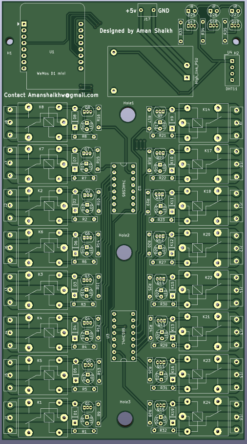
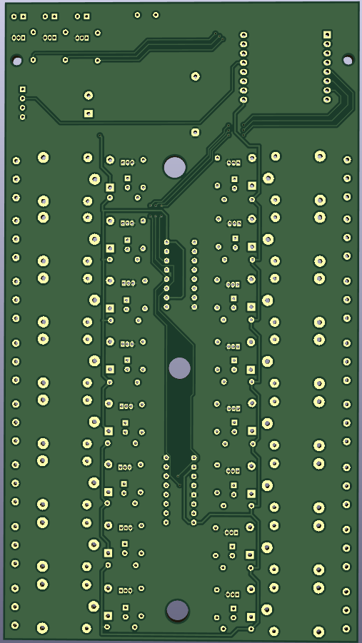
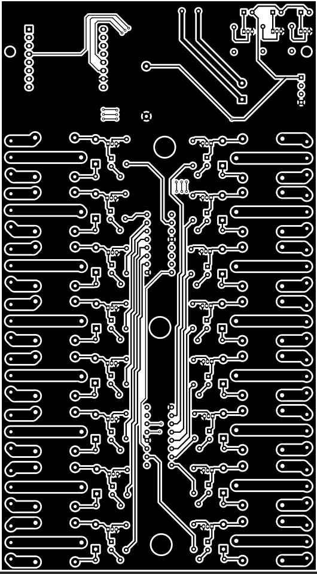

# Esp 8266 Automation development board
This is a ESP 8266 Automation module with inbulit power supply, DHT11, DHT22 and 3 IR led.  
## Features of the module:
<ol>
  <li>On board power supply 220V to 5v</li>
  <li>Can control 16 Relay modules</li>
  <li>ON board programming supported via micro USB</li>
  <li>On board DHT11,DHT22 sensor support</li>
  <li>On board IR LED's for controlling IR enabled devivices such as (AC's , TV's etc)</li>
  <li>4 Mounting holes provided for mounting</li>
</ol>

## Materials required:
<table align="center">
  <tr>
    <th>No.</th>
    <th>Component</th>
    <th>Quantity</th>
  </tr>
  <tr>
    <td>1</td>
    <td>Esp8266 wemos D1 mini</td>
    <td>1</td>
  </tr>
  <tr>
    <td>2</td>
    <td>74HC595 shift resistor</td>
    <td>2</td>
  </tr>
  <tr>
    <td>3</td>
    <td>1N4007 Diode</td>
    <td>16</td>
  </tr>
  <tr>
    <td>4</td>
    <td>BC548 NPN transistor</td>
    <td>19</td>
  </tr>
   <tr>
    <td>5</td>
    <td>LED 5mm (Any color)</td>
    <td>16</td>
  </tr>
  <tr>
    <td>6</td>
    <td>Resistor 1k Ω </td>
    <td>32</td>
  </tr>
  <tr>
    <td>7</td>
    <td>Relays 5v</td>
    <td>16</td>
  </tr>
  <tr>
  <td>8</td>
    <td>Screw connector 3 pin 5.08mm</td>
    <td>16</td>
  </tr>

  <tr>
    <td>9</td>
    <td>220 Ω </td>
    <td>3</td>
  </tr>
  <tr>
    <td>10</td>
    <td>IR Led's</td>
    <td>3</td>
  </tr>
  
  <tr>
    <td>11</td>
    <td>Hilink power supply 12v or 5v*</td>
    <td>1</td>
  </tr>
    <tr>
    <td>12</td>
    <td>Screw connector 2 pin 5.08mm</td>
    <td>1</td>
  </tr>
  
   <tr>
    <td>13</td>
    <td>Female Headers strip</td>
    <td>1</td>
  </tr>
</table>

 

<h3 align="center">Front and Bottom view of the board view of the board</h3>
 

  
  

  <h3 align="center">Black and White front layout</h3>

  
  
## How to program the board:
<ol>
<li>Firstly disconnect any load that is connected to the relay</li>
<li>Now power the board via AC or DC (DC recomended)</li>
<li>connect the micro usb cable to webmos d1 mini board</li>
  <li>After this you should be able to program board using any prefered IDE</li>
</ol>

## How to order:
  <ol>
    <li>Download and extract the git-hub file</li>
    <li>Find the Board Gerbers form the Gerber folder</li>
    <li>Now upload the gerber zip file to you pcb manufacturer (JLCPCB recomended)</li>
    <li>Now you can place the order</li>
   </ol>

## Use cases:
<ol>
<li>Module is well suited for automation systems</li>
<li>Can be used to control lots of devices</li>
<li>Easy to Program and develop solutions that require automation</li>
<li>Provides a cost effective solution</li>
</ol>
